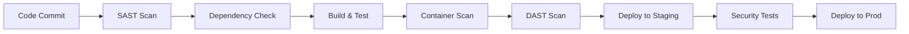

# Building My First DevSecOps Pipeline

Six months ago, deployments at my company were a manual nightmare: developers throwing code over the wall, security teams scrambling to review changes, and operations wondering why everything broke in production. Today, we have a fully automated DevSecOps pipeline that catches security issues early and deploys confidently. Here's how we got there.

## The Starting Point

### Before: Manual Security Theater
```bash
# Our "security process"
1. Developer: "Hey, can you review this?"
2. Security: "What does it do?"
3. Developer: "It's just a small change..."
4. Security: *panic reviews for 10 minutes*
5. Deploy: *everything breaks*
```

### The Wake-Up Call
A critical vulnerability made it to production because our manual review process missed a dependency with known CVEs. That's when management finally understood: security can't be an afterthought.

## Pipeline Architecture

### High-Level Overview


### Technology Stack
- **CI/CD**: GitHub Actions
- **SAST**: SonarQube, Semgrep
- **Dependency Scanning**: Snyk, OWASP Dependency-Check
- **Container Security**: Trivy, Docker Scout
- **DAST**: OWASP ZAP
- **Infrastructure**: Terraform, AWS
- **Monitoring**: DataDog, AWS CloudWatch

## Implementation Journey

### Phase 1: Static Analysis (Week 1-2)

**Started Simple:**
```yaml
# .github/workflows/security.yml
name: Security Scan

on: [push, pull_request]

jobs:
  sast:
    runs-on: ubuntu-latest
    steps:
      - uses: actions/checkout@v3
      
      - name: Run Semgrep
        uses: semgrep/semgrep-action@v1
        with:
          config: auto
```

**First Results:**
- 🔴 127 high-severity findings
- 😱 Hardcoded secrets everywhere
- 🤦‍♂️ SQL injection vulnerabilities
- 📊 Lots of false positives

**Lesson Learned:** Start with basic rules, tune gradually.

### Phase 2: Dependency Management (Week 3-4)

**Added Dependency Scanning:**
```yaml
      - name: Run Snyk
        uses: snyk/actions/node@master
        env:
          SNYK_TOKEN: ${{ secrets.SNYK_TOKEN }}
        with:
          args: --severity-threshold=high
```

**The Shock:**
```bash
# Our dependency report
Total vulnerabilities: 47
High severity: 12
Critical: 3

# Some were in dependencies of dependencies of dependencies...
```

**Solution Strategy:**
1. **Automated updates** for patch-level changes
2. **Weekly reviews** for minor updates
3. **Immediate action** for critical vulnerabilities

### Phase 3: Container Security (Week 5-6)

**Added Container Scanning:**
```dockerfile
# Before: Dangerous base image
FROM ubuntu:latest
RUN apt-get update && apt-get install -y curl
USER root

# After: Secure practices
FROM ubuntu:20.04-20230308
RUN apt-get update && apt-get install -y --no-install-recommends curl \
    && rm -rf /var/lib/apt/lists/*
USER 1001
```

**Trivy Integration:**
```yaml
      - name: Run Trivy scanner
        uses: aquasecurity/trivy-action@master
        with:
          image-ref: 'myapp:latest'
          format: 'sarif'
          output: 'trivy-results.sarif'
```

**Results:**
- Reduced base image vulnerabilities by 80%
- Eliminated root user containers
- Implemented multi-stage builds

### Phase 4: Dynamic Testing (Week 7-8)

**OWASP ZAP Integration:**
```yaml
      - name: ZAP Baseline Scan
        uses: zaproxy/action-baseline@v0.7.0
        with:
          target: 'https://staging.myapp.com'
          rules_file_name: '.zap/rules.tsv'
```

**Custom ZAP Rules:**
```tsv
# rules.tsv
10021	IGNORE	# X-Content-Type-Options (handled by CDN)
10020	IGNORE	# X-Frame-Options (SPA application)
10016	WARN	    # Web Browser XSS Protection
```

**Integration Testing:**
```python
# security_tests.py
import requests
import pytest

def test_security_headers():
    response = requests.get("https://staging.myapp.com")
    assert "Strict-Transport-Security" in response.headers
    assert "Content-Security-Policy" in response.headers
    
def test_authentication():
    # Test for authentication bypass
    response = requests.get("https://staging.myapp.com/admin")
    assert response.status_code == 401
```

## Infrastructure as Code Security

### Terraform Security Scanning
```yaml
      - name: tfsec
        uses: aquasecurity/tfsec-action@v1.0.0
        with:
          soft_fail: true
```

**Common Issues Found:**
```hcl
# Bad: Publicly accessible S3 bucket
resource "aws_s3_bucket" "example" {
  bucket = "my-bucket"
  acl    = "public-read"  # 🚨 Security issue
}

# Good: Private bucket with explicit access
resource "aws_s3_bucket" "example" {
  bucket = "my-bucket"
}

resource "aws_s3_bucket_public_access_block" "example" {
  bucket = aws_s3_bucket.example.id

  block_public_acls       = true
  block_public_policy     = true
  ignore_public_acls      = true
  restrict_public_buckets = true
}
```

## The Complete Pipeline

### Final GitHub Actions Workflow
```yaml
name: DevSecOps Pipeline

on:
  push:
    branches: [main, develop]
  pull_request:
    branches: [main]

jobs:
  security-scan:
    runs-on: ubuntu-latest
    steps:
      - uses: actions/checkout@v3
        with:
          fetch-depth: 0

      # Static Analysis
      - name: Run Semgrep
        uses: semgrep/semgrep-action@v1
        with:
          config: auto
          
      - name: SonarQube Scan
        uses: sonarqube-quality-gate-action@master
        env:
          SONAR_TOKEN: ${{ secrets.SONAR_TOKEN }}

      # Dependency Check
      - name: Run Snyk
        uses: snyk/actions/node@master
        env:
          SNYK_TOKEN: ${{ secrets.SNYK_TOKEN }}

      # Build and Test
      - name: Build Application
        run: |
          npm ci
          npm run build
          npm run test

      # Container Security
      - name: Build Docker Image
        run: docker build -t myapp:${{ github.sha }} .

      - name: Run Trivy
        uses: aquasecurity/trivy-action@master
        with:
          image-ref: 'myapp:${{ github.sha }}'

  deploy-staging:
    needs: security-scan
    if: github.ref == 'refs/heads/develop'
    runs-on: ubuntu-latest
    steps:
      - name: Deploy to Staging
        run: |
          # Deployment logic here
          echo "Deploying to staging..."

      # Dynamic Security Testing
      - name: Wait for Deployment
        run: sleep 60

      - name: OWASP ZAP Scan
        uses: zaproxy/action-baseline@v0.7.0
        with:
          target: 'https://staging.myapp.com'

      - name: Run Security Tests
        run: |
          pip install pytest requests
          python -m pytest security_tests.py

  deploy-production:
    needs: deploy-staging
    if: github.ref == 'refs/heads/main'
    runs-on: ubuntu-latest
    steps:
      - name: Deploy to Production
        run: |
          # Production deployment logic
          echo "Deploying to production..."
```

## Metrics and Results

### Before vs After

| Metric | Before | After | Improvement |
|--------|--------|-------|-------------|
| Time to detect vulnerabilities | 2-4 weeks | < 10 minutes | 99.7% faster |
| False positive rate | N/A | 15% | Manageable |
| Deployment frequency | Weekly | Daily | 7x increase |
| Security incidents | 3/month | 0.5/month | 83% reduction |
| Mean time to remediation | 10 days | 2 hours | 99.2% faster |

### Security Findings Breakdown
```bash
# Month 1 findings
Critical: 8
High: 23
Medium: 156
Low: 89

# Month 6 findings
Critical: 0
High: 2
Medium: 12
Low: 34
```

## Lessons Learned

### What Worked Well

1. **Start Simple, Iterate Fast**
   - Begin with basic SAST tools
   - Add complexity gradually
   - Learn from each integration

2. **Developer Education**
```bash
# We created security workshops
- "Secure Coding 101"
- "Container Security Best Practices"
- "DevSecOps Tool Deep Dives"
```

3. **Fail Fast, Fail Cheap**
   - Catch issues in development
   - Quick feedback loops
   - Automated remediation where possible

### What Didn't Work

1. **Too Many Tools Initially**
   - Tool fatigue from developers
   - Conflicting results
   - Maintenance overhead

2. **Blocking on Everything**
   - Slowed development velocity
   - Developer frustration
   - Workarounds emerged

3. **No Security Champion Program**
   - Lack of security knowledge in teams
   - Resistance to security practices
   - Poor tool adoption

## Best Practices

### Security as Code
```yaml
# Security policies as code
security_policy:
  sast:
    block_on: critical
    warn_on: high
  dependencies:
    block_on: critical
    auto_update: patch
  containers:
    block_on: critical
    base_image_policy: "distroless-only"
```

### Gradual Rollout Strategy
```bash
# Week 1-2: Information gathering
- Run scans, don't block
- Collect baseline metrics
- Identify quick wins

# Week 3-4: Start blocking
- Block only critical issues
- Provide clear remediation guidance
- Monitor developer feedback

# Week 5-8: Expand coverage
- Add more tools gradually
- Tune false positive rates
- Integrate with IDE/editors
```

### Developer Experience
```bash
# Make security easy
- Pre-commit hooks for quick feedback
- IDE integrations for real-time scanning
- Clear documentation and examples
- Security champions in each team
```

## Future Improvements

### Next Steps
1. **Runtime Security** - Add runtime monitoring
2. **Threat Modeling** - Integrate architectural security reviews
3. **Red Team Integration** - Automated purple team exercises
4. **Supply Chain Security** - Software Bill of Materials (SBOM)

### Advanced Techniques
```yaml
# Policy as Code with Open Policy Agent
package security.container

deny[msg] {
    input.User == "root"
    msg := "Container must not run as root"
}

deny[msg] {
    count(input.SecurityOpt) == 0
    msg := "Container must define security options"
}
```

## Key Takeaways

1. **Security doesn't have to slow you down** - It can actually speed you up
2. **Start with the basics** - Don't try to implement everything at once
3. **Developer experience matters** - Make security tools easy to use
4. **Measure everything** - You can't improve what you don't measure
5. **Cultural change takes time** - Be patient with adoption

## Resources

- [OWASP DevSecOps Guideline](https://owasp.org/www-project-devsecops-guideline/)
- [NIST Secure Software Development Framework](https://csrc.nist.gov/Projects/secure-software-development-framework)
- [GitHub Security Lab](https://securitylab.github.com/)
- [Cloud Security Alliance](https://cloudsecurityalliance.org/)

---

*Building a DevSecOps pipeline isn't just about tools—it's about creating a culture where security is everyone's responsibility.*
