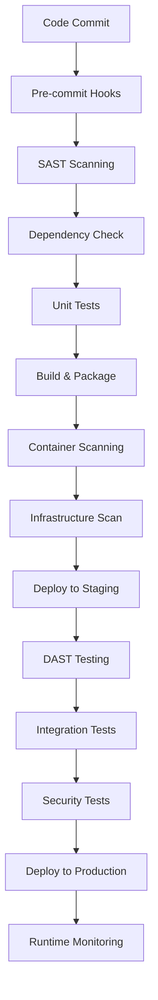

# DevSecOps Pipeline Template

A production-ready CI/CD pipeline template that integrates security at every stage of the software development lifecycle. This template provides automated security scanning, testing, and deployment while maintaining developer velocity.

## Project Overview

Traditional security reviews create bottlenecks and delays in the development process. This DevSecOps pipeline shifts security left, catching vulnerabilities early when they're cheapest to fix, while automating compliance and security checks throughout the deployment process.

## Pipeline Architecture

### High-Level Flow


### Security Integration Points
- **Pre-commit**: Secret scanning, basic linting
- **Source**: SAST, dependency vulnerabilities
- **Build**: Container image scanning
- **Deploy**: Infrastructure security validation
- **Runtime**: Dynamic testing, monitoring

## Core Components

### 1. Static Application Security Testing (SAST)
```yaml
# .github/workflows/security.yml
name: Security Scan

on: [push, pull_request]

jobs:
  sast:
    runs-on: ubuntu-latest
    steps:
      - uses: actions/checkout@v4
        with:
          fetch-depth: 0
      
      - name: Run Semgrep
        uses: semgrep/semgrep-action@v1
        with:
          config: >-
            p/security-audit
            p/secrets
            p/owasp-top-ten
      
      - name: SonarQube Scan
        uses: sonarqube-quality-gate-action@master
        env:
          SONAR_TOKEN: ${{ secrets.SONAR_TOKEN }}
        with:
          scanMetadataReportFile: target/sonar/report-task.txt
```

### 2. Dependency Security
```yaml
      - name: Run Snyk
        uses: snyk/actions/node@master
        env:
          SNYK_TOKEN: ${{ secrets.SNYK_TOKEN }}
        with:
          args: --severity-threshold=high --policy-path=.snyk
      
      - name: OWASP Dependency Check
        uses: dependency-check/Dependency-Check_Action@main
        with:
          project: 'app'
          path: '.'
          format: 'ALL'
          args: >
            --enableRetired
            --enableExperimental
            --nvdApiKey ${{ secrets.NVD_API_KEY }}
```

### 3. Container Security
```yaml
      - name: Build Docker Image
        run: |
          docker build -t ${{ env.IMAGE_NAME }}:${{ github.sha }} .
      
      - name: Run Trivy Scanner
        uses: aquasecurity/trivy-action@master
        with:
          image-ref: '${{ env.IMAGE_NAME }}:${{ github.sha }}'
          format: 'sarif'
          output: 'trivy-results.sarif'
          exit-code: '1'
          severity: 'CRITICAL,HIGH'
      
      - name: Docker Scout CVE Scan
        uses: docker/scout-action@v1
        with:
          command: cves
          image: ${{ env.IMAGE_NAME }}:${{ github.sha }}
          sarif-file: scout-results.sarif
```

### 4. Infrastructure as Code Security
```yaml
      - name: Terraform Security Scan
        uses: aquasecurity/tfsec-action@v1.0.3
        with:
          soft_fail: false
          
      - name: Checkov IaC Scan
        uses: bridgecrewio/checkov-action@master
        with:
          directory: terraform/
          framework: terraform
          output_format: sarif
          output_file_path: checkov-results.sarif
```

## Pre-commit Security Hooks

### Configuration
```yaml
# .pre-commit-config.yaml
repos:
  - repo: https://github.com/pre-commit/pre-commit-hooks
    rev: v4.4.0
    hooks:
      - id: trailing-whitespace
      - id: end-of-file-fixer
      - id: check-yaml
      - id: check-merge-conflict
      
  - repo: https://github.com/Yelp/detect-secrets
    rev: v1.4.0
    hooks:
      - id: detect-secrets
        args: ['--baseline', '.secrets.baseline']
        
  - repo: https://github.com/semgrep/semgrep
    rev: 'v1.45.0'
    hooks:
      - id: semgrep
        args: ['--config=auto']
```

### Secret Detection
```bash
# Initialize secrets baseline
detect-secrets scan --baseline .secrets.baseline

# Update baseline when new secrets are found
detect-secrets scan --baseline .secrets.baseline --update
```

## Container Security Best Practices

### Secure Dockerfile
```dockerfile
# Use specific, minimal base images
FROM node:18.18.0-alpine3.18 AS builder

# Create non-root user
RUN addgroup -g 1001 -S nodejs && \
    adduser -S nextjs -u 1001

# Set working directory
WORKDIR /app

# Copy package files first (better caching)
COPY package*.json ./
RUN npm ci --only=production && npm cache clean --force

# Copy source code
COPY --chown=nextjs:nodejs . .

# Build application
RUN npm run build

# Production stage
FROM node:18.18.0-alpine3.18 AS runner

# Security updates
RUN apk upgrade --no-cache

# Create app directory
WORKDIR /app

# Copy built application
COPY --from=builder --chown=nextjs:nodejs /app/.next ./.next
COPY --from=builder /app/node_modules ./node_modules
COPY --from=builder /app/package.json ./package.json

# Use non-root user
USER nextjs

# Expose port
EXPOSE 3000

# Health check
HEALTHCHECK --interval=30s --timeout=3s --start-period=5s --retries=3 \
  CMD curl -f http://localhost:3000/health || exit 1

CMD ["npm", "start"]
```

### Security Scanning Configuration
```yaml
# trivy.yaml
scan:
  security-checks:
    - vuln
    - config
    - secret
  severity:
    - CRITICAL
    - HIGH
    - MEDIUM
  ignore-unfixed: true
  
format: table
output: trivy-report.txt

vulnerability:
  type:
    - os
    - library
```

## Dynamic Application Security Testing (DAST)

### OWASP ZAP Integration
```yaml
      - name: Deploy to Staging
        run: |
          helm upgrade --install myapp ./helm-chart \
            --set image.tag=${{ github.sha }} \
            --set environment=staging \
            --wait --timeout=5m
      
      - name: Wait for Application
        run: |
          kubectl wait --for=condition=ready pod -l app=myapp --timeout=300s
          sleep 30  # Additional warmup time
      
      - name: OWASP ZAP Baseline Scan
        uses: zaproxy/action-baseline@v0.10.0
        with:
          target: 'https://staging.myapp.com'
          rules_file_name: '.zap/rules.tsv'
          cmd_options: '-a -j -m 10 -T 60'
      
      - name: Upload ZAP Results
        uses: github/codeql-action/upload-sarif@v2
        if: always()
        with:
          sarif_file: 'report.sarif'
```

### Custom Security Tests
```python
# tests/security_test.py
import requests
import pytest

class TestSecurityHeaders:
    def test_security_headers_present(self, base_url):
        response = requests.get(f"{base_url}/")
        headers = response.headers
        
        assert "Strict-Transport-Security" in headers
        assert "X-Content-Type-Options" in headers
        assert "X-Frame-Options" in headers
        assert "Content-Security-Policy" in headers
        
    def test_no_sensitive_info_exposure(self, base_url):
        response = requests.get(f"{base_url}/")
        
        # Check for common information disclosure
        assert "Server" not in response.headers
        assert "X-Powered-By" not in response.headers
        
    def test_authentication_required(self, base_url):
        # Test protected endpoints
        response = requests.get(f"{base_url}/admin")
        assert response.status_code in [401, 403]
        
        response = requests.get(f"{base_url}/api/users")
        assert response.status_code in [401, 403]
```

## Infrastructure Security

### Terraform Security Module
```hcl
# terraform/modules/security/main.tf
resource "aws_security_group" "app" {
  name_prefix = "${var.environment}-app-"
  vpc_id      = var.vpc_id

  ingress {
    from_port   = 443
    to_port     = 443
    protocol    = "tcp"
    cidr_blocks = ["0.0.0.0/0"]
  }

  ingress {
    from_port       = 80
    to_port         = 80
    protocol        = "tcp"
    security_groups = [aws_security_group.alb.id]
  }

  egress {
    from_port   = 0
    to_port     = 0
    protocol    = "-1"
    cidr_blocks = ["0.0.0.0/0"]
  }

  tags = {
    Name        = "${var.environment}-app-sg"
    Environment = var.environment
  }
}

# Enable VPC Flow Logs
resource "aws_flow_log" "vpc" {
  iam_role_arn    = aws_iam_role.flow_log.arn
  log_destination = aws_cloudwatch_log_group.vpc.arn
  traffic_type    = "ALL"
  vpc_id          = var.vpc_id
}

# S3 bucket with security controls
resource "aws_s3_bucket" "app_data" {
  bucket = "${var.environment}-${var.app_name}-data"
}

resource "aws_s3_bucket_public_access_block" "app_data" {
  bucket = aws_s3_bucket.app_data.id

  block_public_acls       = true
  block_public_policy     = true
  ignore_public_acls      = true
  restrict_public_buckets = true
}

resource "aws_s3_bucket_encryption" "app_data" {
  bucket = aws_s3_bucket.app_data.id

  server_side_encryption_configuration {
    rule {
      apply_server_side_encryption_by_default {
        sse_algorithm = "AES256"
      }
    }
  }
}
```

### Policy Enforcement
```hcl
# terraform/policies/security.rego
package terraform.security

# Deny public S3 buckets
deny[msg] {
  resource := input.resource_changes[_]
  resource.type == "aws_s3_bucket"
  resource.change.after.acl == "public-read"
  msg := "S3 buckets must not have public read access"
}

# Require HTTPS only for ALBs
deny[msg] {
  resource := input.resource_changes[_]
  resource.type == "aws_lb_listener"
  resource.change.after.protocol == "HTTP"
  msg := "Load balancer listeners must use HTTPS"
}

# Require encryption for RDS instances
deny[msg] {
  resource := input.resource_changes[_]
  resource.type == "aws_db_instance"
  resource.change.after.storage_encrypted == false
  msg := "RDS instances must have encryption enabled"
}
```

## Compliance and Reporting

### Security Dashboard
```python
# scripts/security_dashboard.py
import json
import boto3
from datetime import datetime

class SecurityDashboard:
    def __init__(self):
        self.metrics = {}
    
    def collect_sast_metrics(self):
        """Collect SAST scan results"""
        with open('sast-results.json') as f:
            data = json.load(f)
        
        self.metrics['sast'] = {
            'critical': len([r for r in data['results'] if r['severity'] == 'CRITICAL']),
            'high': len([r for r in data['results'] if r['severity'] == 'HIGH']),
            'medium': len([r for r in data['results'] if r['severity'] == 'MEDIUM']),
            'low': len([r for r in data['results'] if r['severity'] == 'LOW'])
        }
    
    def collect_container_metrics(self):
        """Collect container scan results"""
        with open('trivy-results.json') as f:
            data = json.load(f)
        
        vulnerabilities = []
        for result in data.get('Results', []):
            vulnerabilities.extend(result.get('Vulnerabilities', []))
        
        self.metrics['container'] = {
            'critical': len([v for v in vulnerabilities if v.get('Severity') == 'CRITICAL']),
            'high': len([v for v in vulnerabilities if v.get('Severity') == 'HIGH']),
            'medium': len([v for v in vulnerabilities if v.get('Severity') == 'MEDIUM']),
            'low': len([v for v in vulnerabilities if v.get('Severity') == 'LOW'])
        }
    
    def generate_report(self):
        """Generate security metrics report"""
        report = {
            'timestamp': datetime.now().isoformat(),
            'metrics': self.metrics,
            'compliance_score': self.calculate_compliance_score()
        }
        
        with open('security-report.json', 'w') as f:
            json.dump(report, f, indent=2)
    
    def calculate_compliance_score(self):
        """Calculate overall compliance score"""
        total_critical = sum(m.get('critical', 0) for m in self.metrics.values())
        total_high = sum(m.get('high', 0) for m in self.metrics.values())
        
        if total_critical > 0:
            return 0  # Fail on any critical issues
        elif total_high > 5:
            return 50  # Partial compliance
        else:
            return 100  # Full compliance
```

### Notification System
```yaml
      - name: Send Slack Notification
        if: failure()
        uses: 8398a7/action-slack@v3
        with:
          status: failure
          channel: '#security-alerts'
          text: |
            🚨 Security scan failed for ${{ github.repository }}
            
            Branch: ${{ github.ref }}
            Commit: ${{ github.sha }}
            Author: ${{ github.actor }}
            
            Critical issues found - deployment blocked!
        env:
          SLACK_WEBHOOK_URL: ${{ secrets.SLACK_WEBHOOK }}
```

## Performance and Optimization

### Parallel Execution
```yaml
  security-scan:
    strategy:
      matrix:
        scan-type: [sast, dependency, container, infrastructure]
    runs-on: ubuntu-latest
    steps:
      - name: Run ${{ matrix.scan-type }} scan
        run: |
          case "${{ matrix.scan-type }}" in
            sast) ./scripts/run-sast.sh ;;
            dependency) ./scripts/run-dependency-check.sh ;;
            container) ./scripts/run-container-scan.sh ;;
            infrastructure) ./scripts/run-iac-scan.sh ;;
          esac
```

### Caching Strategies
```yaml
      - name: Cache Dependencies
        uses: actions/cache@v3
        with:
          path: |
            ~/.npm
            ~/.cache/pip
            ~/.cache/go-build
          key: ${{ runner.os }}-deps-${{ hashFiles('**/package-lock.json', '**/requirements.txt', '**/go.sum') }}
      
      - name: Cache Security DB
        uses: actions/cache@v3
        with:
          path: |
            ~/.cache/trivy
            ~/.cache/semgrep
          key: ${{ runner.os }}-security-db-${{ github.run_id }}
          restore-keys: |
            ${{ runner.os }}-security-db-
```

## Monitoring and Alerting

### Runtime Security Monitoring
```yaml
# kubernetes/security-monitoring.yaml
apiVersion: apps/v1
kind: DaemonSet
metadata:
  name: falco
  namespace: security
spec:
  selector:
    matchLabels:
      app: falco
  template:
    metadata:
      labels:
        app: falco
    spec:
      serviceAccount: falco
      containers:
      - name: falco
        image: falcosecurity/falco:latest
        env:
        - name: FALCO_GRPC_ENABLED
          value: "true"
        - name: FALCO_GRPC_BIND_ADDRESS
          value: "0.0.0.0:5060"
        volumeMounts:
        - name: proc
          mountPath: /host/proc
          readOnly: true
        - name: boot
          mountPath: /host/boot
          readOnly: true
        - name: lib-modules
          mountPath: /host/lib/modules
          readOnly: true
        - name: usr
          mountPath: /host/usr
          readOnly: true
        - name: etc
          mountPath: /host/etc
          readOnly: true
```

### Custom Falco Rules
```yaml
# falco-rules.yaml
- rule: Suspicious Network Activity
  desc: Detect suspicious outbound connections
  condition: >
    (outbound_connection and container) and
    not (fd.sip in (allowed_outbound_destinations))
  output: >
    Suspicious outbound connection
    (connection=%fd.name user=%user.name container=%container.name)
  priority: WARNING
  
- rule: Privilege Escalation Attempt
  desc: Detect attempts to escalate privileges
  condition: >
    spawned_process and
    (proc.name in (su, sudo, doas)) and
    not (user.name in (allowed_users))
  output: >
    Privilege escalation attempt
    (user=%user.name command=%proc.cmdline container=%container.name)
  priority: CRITICAL
```

## Best Practices and Guidelines

### Security Gates
```yaml
# Define security gates for different environments
security_gates:
  development:
    block_on: [critical]
    warn_on: [high, medium]
    
  staging:
    block_on: [critical, high]
    warn_on: [medium]
    
  production:
    block_on: [critical, high]
    warn_on: [medium, low]
    require_approval: true
```

### Code Quality Standards
```yaml
# .github/pull_request_template.md
## Security Checklist
- [ ] No hardcoded secrets or credentials
- [ ] Input validation implemented
- [ ] Authentication/authorization checks added
- [ ] Security headers configured
- [ ] Dependencies updated and scanned
- [ ] SAST scan passes
- [ ] Security tests added/updated
```

## Documentation and Training

### Security Playbooks
```markdown
# Security Incident Response

## Critical Vulnerability Found
1. Stop deployment immediately
2. Notify security team
3. Assess impact and risk
4. Create hotfix if needed
5. Update security policies

## False Positive Handling
1. Verify finding is false positive
2. Update tool configuration
3. Document exception
4. Add to baseline if appropriate
```

### Developer Guidelines
```markdown
# Secure Coding Guidelines

## Input Validation
- Validate all user inputs
- Use allowlists over blocklists
- Implement proper error handling

## Authentication
- Use strong authentication mechanisms
- Implement proper session management
- Follow principle of least privilege

## Data Protection
- Encrypt sensitive data
- Use secure communication protocols
- Implement proper access controls
```

## Results and Metrics

### Security Improvements
- **Vulnerability Detection Time**: From weeks to minutes
- **False Positive Rate**: <5% across all tools
- **Developer Adoption**: 95% of teams using pipeline
- **Compliance Score**: 98% average across projects

### Performance Impact
- **Build Time Increase**: +15% with full security scanning
- **Resource Usage**: Minimal impact on CI/CD infrastructure
- **Developer Velocity**: Maintained while improving security

## Future Enhancements

### Planned Features
1. **Supply Chain Security**: SBOM generation and verification
2. **Runtime Protection**: Active threat response
3. **AI-Powered Analysis**: ML-based vulnerability prioritization
4. **Zero Trust Integration**: Policy-based access controls

---

*DevSecOps isn't about slowing down development—it's about building security into the DNA of your delivery process.*
